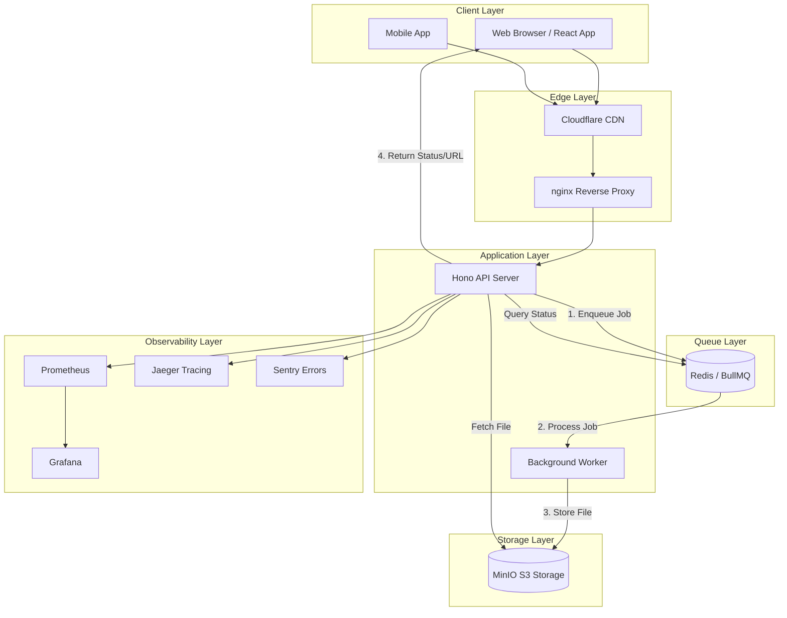
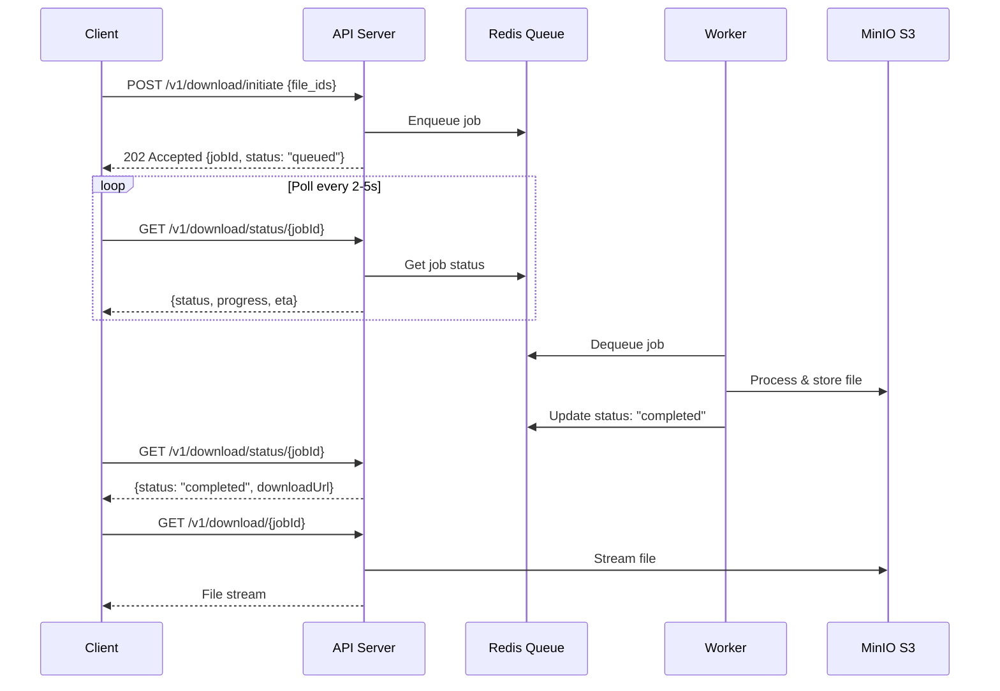

# Architecture Design: Long-Running Download System

## Overview

This document describes the architecture for handling long-running file downloads (10s - 120s+) in a scalable, fault-tolerant manner that works behind reverse proxies like Cloudflare, nginx, and AWS ALB.

---

## Architecture Diagram



---

## Selected Pattern: **Option A — Polling Pattern**

### Why Polling?

| Factor | Polling | WebSocket | Webhook |
|--------|---------|-----------|---------|
| **Proxy Compatibility** | ✅ Excellent | ⚠️ Requires special config | ✅ Good |
| **Implementation Complexity** | ✅ Simple | ❌ Complex | ⚠️ Medium |
| **Client Support** | ✅ Universal | ⚠️ Varies | ❌ Server-only |
| **Cloudflare Support** | ✅ Native | ⚠️ Limited | ✅ Native |
| **Scalability** | ✅ Stateless | ❌ Stateful | ✅ Stateless |

---

## API Design

### New Endpoints

```
POST /v1/download/initiate     → Create download job (returns jobId)
GET  /v1/download/status/:id   → Poll job status
GET  /v1/download/:id          → Download completed file
DELETE /v1/download/:id        → Cancel/cleanup job
```

### Flow Sequence



---

## Implementation Details

### 1. Redis Job Schema (BullMQ)

```typescript
// Job Data Structure
interface DownloadJob {
  id: string;                    // UUID
  fileIds: number[];             // Requested file IDs
  status: JobStatus;             // queued | processing | completed | failed
  progress: number;              // 0-100
  createdAt: string;             // ISO timestamp
  updatedAt: string;             // ISO timestamp
  completedAt?: string;          // ISO timestamp
  error?: string;                // Error message if failed
  downloadUrl?: string;          // S3 presigned URL when complete
  expiresAt?: string;            // URL expiration time
  metadata: {
    totalFiles: number;
    processedFiles: number;
    totalSizeBytes: number;
    requestId: string;           // Trace correlation
    clientIp: string;
  };
}

type JobStatus = 'queued' | 'processing' | 'completed' | 'failed' | 'cancelled';
```

### 2. Queue Configuration (BullMQ)

```typescript
import { Queue, Worker } from 'bullmq';

const downloadQueue = new Queue('downloads', {
  connection: {
    host: process.env.REDIS_HOST || 'localhost',
    port: parseInt(process.env.REDIS_PORT || '6379'),
  },
  defaultJobOptions: {
    attempts: 3,
    backoff: {
      type: 'exponential',
      delay: 5000,
    },
    removeOnComplete: {
      age: 3600,        // Keep completed jobs for 1 hour
      count: 1000,      // Keep last 1000 completed jobs
    },
    removeOnFail: {
      age: 86400,       // Keep failed jobs for 24 hours
    },
  },
});

const worker = new Worker('downloads', processDownload, {
  connection: redisConnection,
  concurrency: 5,        // Process 5 jobs simultaneously
  limiter: {
    max: 10,             // Max 10 jobs per minute
    duration: 60000,
  },
});
```

### 3. API Endpoint Implementation

```typescript
// POST /v1/download/initiate
app.post('/v1/download/initiate', async (c) => {
  const { file_ids } = await c.req.json();
  
  const jobId = crypto.randomUUID();
  const job = await downloadQueue.add('download', {
    id: jobId,
    fileIds: file_ids,
    status: 'queued',
    progress: 0,
    createdAt: new Date().toISOString(),
    metadata: {
      requestId: c.get('requestId'),
      clientIp: c.req.header('cf-connecting-ip') || c.req.header('x-forwarded-for'),
    },
  });

  return c.json({
    jobId,
    status: 'queued',
    statusUrl: `/v1/download/status/${jobId}`,
    estimatedTime: calculateEta(file_ids.length),
  }, 202);
});

// GET /v1/download/status/:id
app.get('/v1/download/status/:id', async (c) => {
  const { id } = c.req.param();
  const job = await downloadQueue.getJob(id);
  
  if (!job) {
    return c.json({ error: 'Job not found' }, 404);
  }

  const state = await job.getState();
  
  return c.json({
    jobId: id,
    status: state,
    progress: job.progress || 0,
    createdAt: job.data.createdAt,
    ...(state === 'completed' && {
      downloadUrl: `/v1/download/${id}`,
      expiresAt: job.data.expiresAt,
    }),
    ...(state === 'failed' && {
      error: job.failedReason,
    }),
  });
});
```

### 4. Error Handling

```typescript
// Retry strategy with exponential backoff
const retryStrategy = {
  attempts: 3,
  backoff: {
    type: 'exponential',
    delay: 5000,  // 5s, 10s, 20s
  },
};

// Dead letter queue for permanent failures
const dlq = new Queue('downloads-dlq', { connection });

worker.on('failed', async (job, err) => {
  if (job.attemptsMade >= job.opts.attempts) {
    await dlq.add('failed-download', {
      ...job.data,
      error: err.message,
      failedAt: new Date().toISOString(),
    });
    
    // Alert via Sentry
    Sentry.captureException(err, {
      extra: { jobId: job.id, fileIds: job.data.fileIds },
    });
  }
});
```

---

## Proxy Configuration

### Cloudflare Configuration

```yaml
# Cloudflare Page Rules / Transform Rules

# 1. Increase timeout for download endpoints
# Enterprise: Set to 600s for long downloads
# Free/Pro: Cannot exceed 100s - use polling pattern

# 2. Cache bypass for dynamic endpoints
Page Rule: *example.com/v1/download/*
  - Cache Level: Bypass
  - Browser TTL: Respect Existing Headers

# 3. Rate limiting
Rate Limiting Rule:
  - URI Path contains "/v1/download/initiate"
  - Requests per 10 seconds: 10
  - Action: Block
```

**Cloudflare Workers (Optional)**:
```javascript
// For presigned URL generation at edge
export default {
  async fetch(request, env) {
    const url = new URL(request.url);
    
    if (url.pathname.startsWith('/v1/download/')) {
      // Add timeout headers
      const response = await fetch(request, {
        cf: { cacheTtl: 0 },
      });
      
      return new Response(response.body, {
        ...response,
        headers: {
          ...response.headers,
          'X-Accel-Buffering': 'no',
        },
      });
    }
    
    return fetch(request);
  },
};
```

### nginx Configuration

```nginx
# /etc/nginx/conf.d/delineate.conf

upstream delineate_api {
    server delineate-app:3000;
    keepalive 32;
}

server {
    listen 80;
    server_name api.example.com;

    # Global timeouts
    proxy_connect_timeout 10s;
    proxy_send_timeout 30s;
    proxy_read_timeout 30s;

    # Quick endpoints (initiate, status)
    location ~ ^/v1/download/(initiate|status) {
        proxy_pass http://delineate_api;
        proxy_http_version 1.1;
        proxy_set_header Connection "";
        proxy_set_header Host $host;
        proxy_set_header X-Real-IP $remote_addr;
        proxy_set_header X-Forwarded-For $proxy_add_x_forwarded_for;
        proxy_set_header X-Request-ID $request_id;
        
        # Short timeout for polling endpoints
        proxy_read_timeout 10s;
    }

    # File download endpoint (longer timeout)
    location ~ ^/v1/download/[a-f0-9-]+$ {
        proxy_pass http://delineate_api;
        proxy_http_version 1.1;
        proxy_set_header Connection "";
        proxy_set_header Host $host;
        proxy_set_header X-Real-IP $remote_addr;
        
        # Longer timeout for actual file transfer
        proxy_read_timeout 300s;
        proxy_buffering off;
        
        # Stream response
        proxy_set_header X-Accel-Buffering no;
    }

    # Health check (no buffering)
    location /health {
        proxy_pass http://delineate_api;
        proxy_read_timeout 5s;
    }
}
```

### AWS ALB Configuration

```yaml
# Terraform example
resource "aws_lb_target_group" "delineate" {
  name     = "delineate-api"
  port     = 3000
  protocol = "HTTP"
  vpc_id   = var.vpc_id

  health_check {
    enabled             = true
    healthy_threshold   = 2
    interval            = 30
    matcher             = "200"
    path                = "/health"
    port                = "traffic-port"
    protocol            = "HTTP"
    timeout             = 5
    unhealthy_threshold = 3
  }

  # Deregistration delay for graceful shutdown
  deregistration_delay = 30

  stickiness {
    type            = "lb_cookie"
    cookie_duration = 3600
    enabled         = false  # Stateless API
  }
}

# Listener rule with idle timeout
resource "aws_lb_listener_rule" "download" {
  listener_arn = aws_lb_listener.https.arn
  priority     = 100

  action {
    type             = "forward"
    target_group_arn = aws_lb_target_group.delineate.arn
  }

  condition {
    path_pattern {
      values = ["/v1/download/*"]
    }
  }
}

# Set idle timeout at ALB level
resource "aws_lb" "main" {
  idle_timeout = 60  # Max 4000 seconds
}
```

---

## Frontend Integration (React/Next.js)

### Download Hook

```typescript
// hooks/useDownload.ts
import { useState, useCallback, useRef, useEffect } from 'react';

interface DownloadState {
  jobId: string | null;
  status: 'idle' | 'queued' | 'processing' | 'completed' | 'failed';
  progress: number;
  error: string | null;
  downloadUrl: string | null;
}

interface UseDownloadOptions {
  pollingInterval?: number;
  maxRetries?: number;
  onComplete?: (url: string) => void;
  onError?: (error: string) => void;
}

export function useDownload(options: UseDownloadOptions = {}) {
  const {
    pollingInterval = 2000,
    maxRetries = 3,
    onComplete,
    onError,
  } = options;

  const [state, setState] = useState<DownloadState>({
    jobId: null,
    status: 'idle',
    progress: 0,
    error: null,
    downloadUrl: null,
  });

  const pollingRef = useRef<NodeJS.Timeout | null>(null);
  const retriesRef = useRef(0);

  // Cleanup on unmount
  useEffect(() => {
    return () => {
      if (pollingRef.current) {
        clearInterval(pollingRef.current);
      }
    };
  }, []);

  // Save state to localStorage for browser close recovery
  useEffect(() => {
    if (state.jobId && state.status !== 'idle') {
      localStorage.setItem('pendingDownload', JSON.stringify(state));
    } else {
      localStorage.removeItem('pendingDownload');
    }
  }, [state]);

  // Recover pending download on mount
  useEffect(() => {
    const saved = localStorage.getItem('pendingDownload');
    if (saved) {
      const savedState = JSON.parse(saved) as DownloadState;
      if (['queued', 'processing'].includes(savedState.status)) {
        setState(savedState);
        startPolling(savedState.jobId!);
      }
    }
  }, []);

  const startPolling = useCallback((jobId: string) => {
    if (pollingRef.current) {
      clearInterval(pollingRef.current);
    }

    pollingRef.current = setInterval(async () => {
      try {
        const response = await fetch(`/v1/download/status/${jobId}`);
        
        if (!response.ok) {
          throw new Error('Failed to fetch status');
        }

        const data = await response.json();
        
        setState(prev => ({
          ...prev,
          status: data.status,
          progress: data.progress || 0,
          downloadUrl: data.downloadUrl || null,
        }));

        // Stop polling on completion or failure
        if (data.status === 'completed') {
          clearInterval(pollingRef.current!);
          pollingRef.current = null;
          onComplete?.(data.downloadUrl);
        } else if (data.status === 'failed') {
          clearInterval(pollingRef.current!);
          pollingRef.current = null;
          setState(prev => ({ ...prev, error: data.error }));
          onError?.(data.error);
        }

        retriesRef.current = 0;
      } catch (error) {
        retriesRef.current++;
        
        if (retriesRef.current >= maxRetries) {
          clearInterval(pollingRef.current!);
          pollingRef.current = null;
          setState(prev => ({
            ...prev,
            status: 'failed',
            error: 'Connection lost. Please try again.',
          }));
          onError?.('Connection lost');
        }
      }
    }, pollingInterval);
  }, [pollingInterval, maxRetries, onComplete, onError]);

  const initiateDownload = useCallback(async (fileIds: number[]) => {
    setState({
      jobId: null,
      status: 'queued',
      progress: 0,
      error: null,
      downloadUrl: null,
    });

    try {
      const response = await fetch('/v1/download/initiate', {
        method: 'POST',
        headers: { 'Content-Type': 'application/json' },
        body: JSON.stringify({ file_ids: fileIds }),
      });

      if (!response.ok) {
        throw new Error('Failed to initiate download');
      }

      const data = await response.json();
      
      setState(prev => ({
        ...prev,
        jobId: data.jobId,
        status: 'queued',
      }));

      startPolling(data.jobId);
      
      return data.jobId;
    } catch (error) {
      setState(prev => ({
        ...prev,
        status: 'failed',
        error: error instanceof Error ? error.message : 'Unknown error',
      }));
      throw error;
    }
  }, [startPolling]);

  const cancelDownload = useCallback(async () => {
    if (pollingRef.current) {
      clearInterval(pollingRef.current);
      pollingRef.current = null;
    }

    if (state.jobId) {
      try {
        await fetch(`/v1/download/${state.jobId}`, { method: 'DELETE' });
      } catch {
        // Ignore cancellation errors
      }
    }

    setState({
      jobId: null,
      status: 'idle',
      progress: 0,
      error: null,
      downloadUrl: null,
    });
  }, [state.jobId]);

  return {
    ...state,
    initiateDownload,
    cancelDownload,
    isLoading: ['queued', 'processing'].includes(state.status),
  };
}
```

### Download Component

```tsx
// components/DownloadButton.tsx
import { useDownload } from '@/hooks/useDownload';

interface DownloadButtonProps {
  fileIds: number[];
}

export function DownloadButton({ fileIds }: DownloadButtonProps) {
  const {
    status,
    progress,
    error,
    downloadUrl,
    isLoading,
    initiateDownload,
    cancelDownload,
  } = useDownload({
    onComplete: (url) => {
      // Auto-download file
      const link = document.createElement('a');
      link.href = url;
      link.download = '';
      document.body.appendChild(link);
      link.click();
      document.body.removeChild(link);
    },
  });

  const handleClick = () => {
    if (isLoading) {
      cancelDownload();
    } else {
      initiateDownload(fileIds);
    }
  };

  return (
    <div className="download-container">
      <button
        onClick={handleClick}
        disabled={status === 'completed'}
        className={`download-btn ${status}`}
      >
        {status === 'idle' && 'Download Files'}
        {status === 'queued' && 'Queued...'}
        {status === 'processing' && `Processing ${progress}%`}
        {status === 'completed' && 'Download Ready'}
        {status === 'failed' && 'Retry Download'}
      </button>

      {isLoading && (
        <div className="progress-bar">
          <div 
            className="progress-fill" 
            style={{ width: `${progress}%` }}
          />
        </div>
      )}

      {error && (
        <p className="error-message">{error}</p>
      )}

      {downloadUrl && (
        <a href={downloadUrl} className="download-link">
          Click here if download doesn't start automatically
        </a>
      )}
    </div>
  );
}
```

### Handling Browser Close Events

```typescript
// Add to your app's root component
useEffect(() => {
  const handleBeforeUnload = (e: BeforeUnloadEvent) => {
    const pendingDownload = localStorage.getItem('pendingDownload');
    if (pendingDownload) {
      const state = JSON.parse(pendingDownload);
      if (['queued', 'processing'].includes(state.status)) {
        e.preventDefault();
        e.returnValue = 'Download in progress. Are you sure you want to leave?';
        return e.returnValue;
      }
    }
  };

  window.addEventListener('beforeunload', handleBeforeUnload);
  return () => window.removeEventListener('beforeunload', handleBeforeUnload);
}, []);
```

---

## Timeout Configuration Summary

| Component | Endpoint | Timeout | Reason |
|-----------|----------|---------|--------|
| Cloudflare | `/v1/download/initiate` | 30s | Quick job creation |
| Cloudflare | `/v1/download/status/*` | 10s | Fast polling response |
| Cloudflare | `/v1/download/:id` | 100s (max) | File transfer |
| nginx | Polling endpoints | 10s | Short-lived connections |
| nginx | Download endpoint | 300s | Stream large files |
| API Server | Request timeout | 30s | General requests |
| BullMQ | Job timeout | 600s | Long processing allowed |
| Redis | Connection timeout | 5s | Fast reconnect |

---

## Scaling Considerations

### Horizontal Scaling

```yaml
# docker-compose.scale.yml
services:
  delineate-app:
    deploy:
      replicas: 3
    
  delineate-worker:
    deploy:
      replicas: 5
```

### Redis Cluster (Production)

```typescript
const connection = new Redis.Cluster([
  { host: 'redis-1', port: 6379 },
  { host: 'redis-2', port: 6379 },
  { host: 'redis-3', port: 6379 },
]);
```

### S3 Presigned URLs (Direct Download)

```typescript
// Skip API for file transfer - direct S3 download
import { getSignedUrl } from '@aws-sdk/s3-request-presigner';
import { GetObjectCommand } from '@aws-sdk/client-s3';

async function generateDownloadUrl(jobId: string): Promise<string> {
  const command = new GetObjectCommand({
    Bucket: process.env.S3_BUCKET_NAME,
    Key: `downloads/${jobId}.zip`,
  });
  
  return getSignedUrl(s3Client, command, { expiresIn: 3600 });
}
```

---

## Monitoring & Alerts

### Key Metrics to Track

| Metric | Alert Threshold | Action |
|--------|-----------------|--------|
| Queue depth | > 100 jobs | Scale workers |
| Job failure rate | > 5% | Investigate errors |
| P95 latency | > 5s | Check bottlenecks |
| Worker memory | > 80% | Scale horizontally |

### Grafana Dashboard Queries

```promql
# Queue depth
bullmq_queue_waiting{queue="downloads"}

# Processing rate
rate(bullmq_jobs_completed_total[5m])

# Failure rate
rate(bullmq_jobs_failed_total[5m]) / rate(bullmq_jobs_completed_total[5m])

# Average processing time
histogram_quantile(0.95, rate(bullmq_job_duration_seconds_bucket[5m]))
```

---

## Security Considerations

1. **Presigned URL Expiration**: Set short expiration (1 hour max)
2. **Rate Limiting**: Limit initiate requests per IP
3. **Job Ownership**: Validate user can access job status
4. **Input Validation**: Validate file_ids are within allowed range
5. **File Size Limits**: Enforce maximum total download size

---

## Conclusion

The **Polling Pattern** provides the best balance of:
- ✅ Proxy compatibility (works with Cloudflare's 100s limit)
- ✅ Simple implementation (no WebSocket complexity)
- ✅ Stateless API servers (easy horizontal scaling)
- ✅ Resilient to network issues (automatic retry on poll)
- ✅ Progress feedback (real-time UI updates)

For extremely large scale (>10k concurrent downloads), consider adding **WebSocket notifications** as a hybrid optimization while keeping polling as the fallback.
